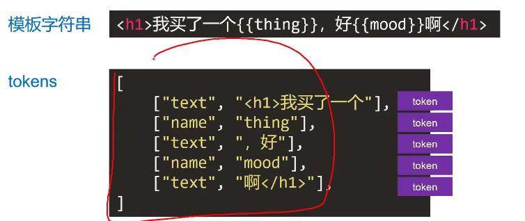

```markdown
1、什么是模板引擎

模板引擎 将数据变为视图最优雅的解决方案
v-for 也是一种模板引擎

2、mustache 基本使用

mustache 是“胡子”的意思，因为它的嵌入标记 {{}} 像胡子

{{}} 中，不能写表达式

js 使用，需要引入 https://github.com/janl/mustache.js

Mutache.render(templateStr, data)
    templateStr: 模板字符串
    data: 数据

exapmle:
* 循环的使用
let templateStr = `<ul>
        {{#arr}}
        <li>
            <div className="hd">{{name}} 的基本信息</div>
            <div className="bd">
                <p>姓名：{{name}}</p>
                <p>年龄：{{age}}</p>
                <p>性别：{{sex}}</p>
            </div>
        </li>
        {{/arr}}
    </ul>`

const data = {
    arr : [
        { name: '小明', age: 12, sex: '男' },
        { name: '小红', age: 13, sex: '女' },
        { name: '小玉', age: 18, sex: '男' }
        ]
    }

var dom = Mustache.render(str, data)
document.getElementById('box').innerHTML = dom

* 不循环
let str = `<h1>我买了一个{{thing}}， 好{{mood}}</h1>`
let data = {
  thing: '华为手机',
  mood: '好开心'
}
let dom = Mustache.render(str, data)
document.getElementById('box').innerHTML = dom
  
* 循环简单数组
let str = `
  <ul>
    {{#arr}}
    <li>{{.}}</li>
    {{/arr}}
  </ul>
  `
let data = {
    arr : ['wang','yang','liu']
}
let dom = Mustache.render(str, data)
document.getElementById('box').innerHTML = dom

* 循环嵌套
let str = `
    <ul>
    {{#arr}}
        <li>{{name}} 的 爱好
          <ol>
          {{#hobbies}}
            <li>
             {{.}}
            </li>
          {{/hobbies}}
          </ol>
        </li>
    {{/arr}}
    </ul>
  `
let data = {
    arr:[
         {
            name: '王',
            hobbies: ['唱歌', '跳舞']
         },
         {
            name: '杨',
            hobbies: ['篮球']
         },
         {
            name: '刘',
            hobbies: ['羽毛球', '打游戏']
         }
        ]
}
let dom = Mustache.render(str, data)
document.getElementById('box').innerHTML = dom


3、mustache 的底层核心肌理

不能使用简单的正则表达式思路实现

tokens 是一个 JS 的嵌套数组，就是模板字符串的JS表示


mustache 库底层重点要做两个事：
  将模板字符串编译为tokens形式
  将tokens结合数据，解析为dom字符串

```
```markdown
模块化打包工具有 webpack （webpack-dev-server）、rollup、 Parcel等。

mustache 官方库是有 rollup 进行模块化打包。
练习使用 webpack（webpack-dev-server）进行模块化打包，是因为 webpack（webpack-dev-server）能让我们
更方便的在浏览器(而不是 nodeJs 环境中)实时调试程序，相比 nodeJs的控制台，浏览器控制台更好用。

生成库是 UMD 的，这意味着它可以同时在 nodeJS 环境中使用，也可以在浏览器环境中使用。 实现UMD不难，是需要一个 “通用头” 即可。


```
